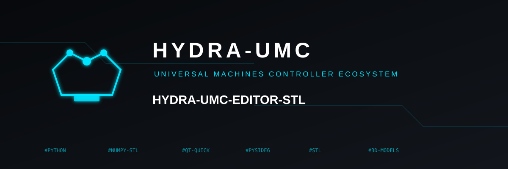

<p align="center">
  
</p>

# 🧩 HYDRA-UMC-EDITOR-STL

<p align="center"><a href="README.md">🇺🇸 English</a> | <a href="README_spa.md">🇪🇸 Español</a> | 🇫🇷 <b>Français</b> | <a href="README_ita.md">🇮🇹 Italiano</a> | <a href="README_deu.md">🇩🇪 Deutsch</a> | <a href="README_zho.md">🇨🇳 简体中文</a> | <a href="README_jpn.md">🇯🇵 日本語</a></p>

### 📦 Parcourir et Éditer les Vraies Bibliothèques de Modèles STL de l'Écosystème HYDRA-UMC

<p align="center">
  
  
  
  
</p>

> **v0.0.1 - scaffolding.** Le vrai noyau CLI/GUI décrit ci-dessous est
> réellement implémenté et testé. Il ne renvoie pas encore une pièce
> éditée vers le vrai catalogue `POST /api/models/submit` de
> HYDRA-UMC-SERVER (comme le fait HYDRA-UMC-EDITOR-URDF pour les modèles
> URDF), et n'offre pas encore d'aperçu 3D en direct d'une pièce avant/
> après une édition - les deux sont un vrai travail futur délimité (voir
> FEUILLE DE ROUTE), pas silencieusement supposé fait.

**Vérification d'honnêteté - ce qui fonctionne vraiment aujourd'hui :**
`model_catalog.py` (découverte réelle, en lecture seule, des deux
bibliothèques de modèles) et `stl_ops.py` (mutation STL réelle via
`numpy-stl` - transformer/remplacer/retirer/ajouter) sont testés contre
de vrais fichiers STL générés (`pytest tests/`, 21 cas réussis) et ont
été vérifiés de bout en bout contre les vrais checkouts
`HYDRA-UMC-STUDIO`/`HYDRA-UMC-SUITE` de cet écosystème
(`--cli categories`/`models`/`parts` contre les vrais arbres ;
`transform`/`remove` contre une copie jetable, jamais le vrai checkout).
La GUI de bureau Qt Quick (`qt_gui.py`, `qml/Main.qml`) se charge et
s'affiche sans erreur QML (vérifié avec `QT_QPA_PLATFORM=offscreen`),
mais n'a pas de test automatisé propre - piloter une vraie boucle
d'événements Qt n'est pas tenté ici, la même limite d'honnêteté que le
propre README de HYDRA-UMC-UPDATER trace déjà pour sa propre couche Qt
Quick.

---

## 1. 🛠️ APERÇU TECHNIQUE

HYDRA-UMC-EDITOR-STL est un petit outil de bureau - GUI fenêtrée par
défaut, CLI complète avec `--cli` - pour éditer les vraies pièces STL
qui composent chaque modèle de robot/machine que distribuent
HYDRA-UMC-STUDIO et HYDRA-UMC-SUITE. Les deux applications ont
réorganisé leurs propres dossiers de modèles en 2026-09 dans la même
vraie structure de catégories (`robots-5-dof`/`robots-6-dof`/
`robots-7-dof`, `machine-pnp`/`machine-cnc`/`machine-laser`,
`heatedbeds`/`racks`/`vacuum-tables`, chaque modèle avec son propre
`metadata.json` à côté de son `ATTRIBUTION.txt`) - cet outil lit cette
même structure réelle, pas une copie séparée ni une base de données
propre.

Quatre opérations réelles, chacune adossée à de vraies E/S fichier
contre le vrai checkout sur disque :

- **Transformer** - translater/pivoter/mettre à l'échelle les vrais
  sommets d'une pièce (via `numpy-stl`, la même bibliothèque dont
  dépend déjà `render/mesh.py` de HYDRA-UMC-SUITE) et la sauvegarder au
  même endroit.
- **Remplacer** - écraser une pièce avec un autre vrai fichier STL.
- **Retirer** - sortir une pièce d'un modèle.
- **Ajouter** - apporter un nouveau vrai fichier STL à un modèle.

**Rien n'est jamais supprimé de façon permanente.** Un retrait ou un
remplacement déplace d'abord le vrai fichier original dans le propre
sous-dossier `.trash/` de ce modèle - la même discipline "ne jamais
détruire, déplacer de côté" déjà suivie par les conventions de travail
internes de cet écosystème, appliquée ici comme une vraie fonctionnalité
produit, pas seulement comme une habitude interne.

## 2. 🧱 ARCHITECTURE ET DÉCISIONS DE CONCEPTION

- **Deux bibliothèques réelles, un seul module de découverte.** La
  propre constante `LIBRARIES` de `model_catalog.py` nomme les deux
  vrais arbres que cet outil édite (`HYDRA-UMC-STUDIO/public/models/`,
  `HYDRA-UMC-SUITE/assets/meshes/`) - ajouter une troisième bibliothèque
  plus tard signifie ajouter une entrée là, pas une seconde
  implémentation de découverte.
- **`stl_ops.py` est le seul endroit qui modifie jamais un fichier.**
  `model_catalog.py` reste strictement en lecture seule ; `--cli` et le
  pont Qt Quick appellent exactement les mêmes fonctions
  `transform_part()`/`replace_part()`/`remove_part()`/`add_part()`,
  donc la GUI ne peut jamais faire quelque chose que la CLI elle-même
  ne pourrait pas faire.
- **Un vrai STL, pas juste un nom de fichier finissant par `.stl`.**
  `is_real_stl()` analyse vraiment un candidat au remplacement/ajout
  avec `numpy-stl` avant qu'il ne soit jamais copié dans un vrai dossier
  de modèle - et, une vraie lacune trouvée en écrivant les propres tests
  de ce projet, rejette aussi un résultat d'analyse à **0 triangle** :
  le propre chemin de repli ASCII de `numpy-stl` ne lève pas d'exception
  sur des octets de charabia arbitraires, il les analyse silencieusement
  comme un maillage vide, donc un simple try/except seul aurait laissé
  passer un fichier qui n'est pas du tout un STL.
- **GUI Qt Quick par défaut, `--cli` pour les systèmes sans affichage.**
  `main.py` n'importe PySide6 que sur le chemin non-`--cli`, donc
  `--cli categories`/`models`/`parts`/`transform`/`replace`/`remove`/
  `add` fonctionnent sur une machine sans affichage ni runtime Qt
  installé du tout.
- **La même vraie couche visuelle que HYDRA-UMC-UPDATER.** `qml/Main.qml`
  réutilise textuellement les propres composants `GameButton`/
  `GameCombo`/`SectionPanel` de ce projet et son thème sombre
  cyan/bleu/ambre/rouge, à la demande explicite du propriétaire du
  projet - un nouvel outil PC dans cet écosystème doit donner
  l'impression d'être le même outil, pas un conçu séparément.
- **Racine de l'écosystème, pas un chemin figé.** Comme la propre racine
  de workspace de HYDRA-UMC-UPDATER, le répertoire parent de ce projet
  lui-même est la valeur par défaut (`default_ecosystem_root()` de
  `main.py`), toujours modifiable (`--root` sur `--cli`, "Parcourir"
  dans la GUI) et mémorisée entre les lancements de la GUI
  (`settings.py`).

## 📂 STRUCTURE DES RÉPERTOIRES

```
HYDRA-UMC-EDITOR-STL/
├── src/hydra_umc_editor_stl/
│   ├── model_catalog.py    # Découverte réelle, en lecture seule, des deux bibliothèques de modèles
│   ├── stl_ops.py           # Mutation STL réelle : transformer/remplacer/retirer/ajouter, sauvegardes .trash/
│   ├── settings.py          # Racine de l'écosystème et préférence de langue persistées
│   ├── i18n.py               # Traductions réelles et complètes de la GUI (7 langues)
│   ├── qt_gui.py             # Pont Qt Quick sur le vrai noyau model_catalog.py/stl_ops.py
│   ├── qml/Main.qml          # Coquille de bureau à thème, partagée avec HYDRA-UMC-UPDATER
│   └── main.py               # Répartition : GUI par défaut, --cli pour categories/models/parts/transform/replace/remove/add
├── tests/                    # Vrais tests contre de vrais fichiers STL générés
├── docs/
│   └── CLI_REFERENCE.md      # Référence des commandes
├── images/                   # Médias et icônes de l'application
├── tools/
│   ├── build_test.py         # Vérification de compilation sans toucher aux versions
│   └── ci_validate.py        # Validation manifeste/CHANGELOG/docs utilisée par la CI
├── build.sh / build.bat      # venv + installation éditable (extras dev+gui) + vérification de compilation + tests
├── run.sh / run.bat          # GUI par défaut / point d'entrée CLI
├── run-gui.vbs               # Lanceur graphique Windows sans fenêtre de console
├── bump_version.py           # Incrémentation "odomètre" à l'échelle de l'écosystème (pyproject.toml + __init__.py)
└── bump_manifest_version.py  # Synchronise la version de hydra-umc.project.json avec la native (--sync)
```

## ⚙️ GUIDE DE COMPILATION ET D'EXÉCUTION

```bash
chmod +x build.sh   # une seule fois
./build.sh          # crée .venv, pip install -e ".[dev,gui]", compile et teste
./run.sh                                                    # GUI fenêtrée (par défaut)
./run.sh --cli categories studio                            # liste les catégories d'une bibliothèque
./run.sh --cli models studio robots-6-dof                   # liste les modèles d'une catégorie
./run.sh --cli parts studio robots-6-dof ar3                 # liste les vrais fichiers de pièces d'un modèle
./run.sh --cli transform studio robots-6-dof ar3 base_link.STL --tz 10
./run.sh --cli replace studio robots-6-dof ar3 base_link.STL /chemin/nouveau.stl
./run.sh --cli remove studio robots-6-dof ar3 base_link.STL
./run.sh --cli add studio robots-6-dof ar3 /chemin/nouveau.stl
```

Sous Windows : `build.bat`, puis `run.bat` (GUI) ou `run.bat --cli ...` /
double-clic sur `run-gui.vbs` pour un lancement de GUI sans console.

`library` est toujours `studio` ou `suite` ; `category`/`model` sont les
vrais noms de dossier que `categories`/`models` viennent d'afficher.
`--root` remplace la racine de l'écosystème pour n'importe quelle
commande `--cli` (par défaut : le propre répertoire parent de cet
outil).

**Dépannage**

- `categories`/`models`/`parts` n'affiche rien : la racine de
  l'écosystème ne contient en réalité pas `HYDRA-UMC-STUDIO`/
  `HYDRA-UMC-SUITE` comme frères - passez `--root` explicitement, ou
  utilisez "Parcourir" dans la GUI.
- `transform`/`replace`/`add` échoue avec "not a real, parseable STL
  file" : le fichier source n'est en réalité pas un STL valide (ou en
  est un à 0 triangle) - ouvrez-le dans un vrai visualiseur CAO/maillage
  pour confirmer.
- Une pièce retirée/remplacée n'a pas disparu de la propre liste de
  pièces de la GUI : elle a bien été déplacée vers `.trash/` sur le
  disque - la liste de pièces ne montre que les vrais fichiers actuels
  de premier niveau, et un sous-dossier `.trash/` en est délibérément
  exclu.

## 🚀 FEUILLE DE ROUTE

- Renvoyer une pièce éditée/ajoutée vers le vrai point de terminaison
  `POST /api/models/submit` de HYDRA-UMC-SERVER, le même vrai point
  d'intégration qu'utilise déjà HYDRA-UMC-EDITOR-URDF pour les modèles
  URDF.
- Un aperçu 3D en direct de la pièce sélectionnée (avant/après une
  transformation), en réutilisant le propre `RobotGLRenderer`/code de
  chargement de maillage de HYDRA-UMC-SUITE plutôt qu'un second
  visualiseur OpenGL séparé.
- Un exécutable de GUI autonome empaqueté (PyInstaller, suivant la même
  convention `build_exe.bat`/`.sh` de HYDRA-UMC-SUITE).
- Annuler/rétablir sur le propre historique `.trash/` d'une session, au
  lieu d'une restauration manuelle de fichier.

## 🔗 Projets Liés

Ce projet fait partie de l'écosystème robotique HYDRA-UMC du même auteur (JuanenRac / Electro Hobby 3D). Bon à savoir, car une demande pourrait en réalité concerner l'un de ceux-ci plutôt que ce dépôt.

**Projet Parent**
- **[HYDRA-UMC-STUDIO](https://github.com/JuanenRac/HYDRA-UMC-STUDIO)** — propriétaire de l'une des deux vraies bibliothèques de modèles que cet éditeur lit et écrit (`public/models/`).

**Directement Liés**
- **[HYDRA-UMC-SUITE](https://github.com/JuanenRac/HYDRA-UMC-SUITE)** — propriétaire de la seconde vraie bibliothèque de modèles que cet éditeur lit et écrit (`assets/meshes/`), maintenue exactement dans la même structure de catégories que celle de STUDIO.
- **[HYDRA-UMC-EDITOR-URDF](https://github.com/JuanenRac/HYDRA-UMC-EDITOR-URDF)** — éditeur de bureau frère pour le côté URDF/cinématique du même catalogue de modèles, plutôt que la géométrie STL brute qu'édite cet outil.
- **[HYDRA-UMC-SERVER](https://github.com/JuanenRac/HYDRA-UMC-SERVER)** — propriétaire du vrai point de terminaison `POST /api/models/submit` vers lequel cet éditeur est prévu pour envoyer ses éditions terminées (voir FEUILLE DE ROUTE - pas encore branché en v0.0.1).

**Fait Également Partie de l'Écosystème**

*Matériel et Plateforme Centrale*
- **[HYDRA-UMC](https://github.com/JuanenRac/HYDRA-UMC)** — la carte mère physique du bras robotique : hôte CM5 + STM32H745 double cœur, orchestrant jusqu'à 8 bras outils via CAN-OTA/SPI-OTA.
- **[HYDRA-UMC-OS](https://github.com/JuanenRac/HYDRA-UMC-OS)** — couche produit Raspberry Pi OS reproductible pour la CM5 : agent en lecture seule, config/profils validés, provisionnement WiFi de premier contact.
- **[HYDRA-UMC-SDK](https://github.com/JuanenRac/HYDRA-UMC-SDK)** — le contrat JSON-Schema partagé et la limite de porte de sécurité contre laquelle chaque bridge valide ses commandes.
- **[HYDRA-UMC-CONNECTOR-HUB](https://github.com/JuanenRac/HYDRA-UMC-CONNECTOR-HUB)** — registre déclaratif de manifestes d'adaptateurs et son validateur pour les connecteurs de machines externes ; étend l'idée de contrat du SDK aux machines externes sans remplacer les projets de passerelle industrielle.

*Backend Central et Clients*
- **[HYDRA-UMC-ANDROID-CONTROL](https://github.com/JuanenRac/HYDRA-UMC-ANDROID-CONTROL)** — application de contrôle Android native avec connexion biométrique et une compagne Wear OS appairée.
- **[HYDRA-UMC-IOS-CONTROL](https://github.com/JuanenRac/HYDRA-UMC-IOS-CONTROL)** — application de contrôle iOS/iPadOS (Flutter) avec synchronisation WebSocket en temps réel.
- **[HYDRA-UMC-DSI](https://github.com/JuanenRac/HYDRA-UMC-DSI)** — UI tactile native pour l'écran tactile DSI 7" embarqué sur la CM5 elle-même.
- **[HYDRA-UMC-EDITOR-URDF](https://github.com/JuanenRac/HYDRA-UMC-EDITOR-URDF)** — créateur/éditeur graphique de bureau pour URDF avec chargement de source GitHub/local et édition avec aperçu 3D en direct.
- **[HYDRA-UMC-BRIDGE-AMR](https://github.com/JuanenRac/HYDRA-UMC-BRIDGE-AMR)** — limite de coordination pour les flottes AGV/AMR via un vrai éditeur MQTT VDA 5050.
- **[HYDRA-UMC-BRIDGE-CNC](https://github.com/JuanenRac/HYDRA-UMC-BRIDGE-CNC)** — coordinateur de cellule CNC de haut niveau avec un vrai accès à l'état/octet de contrôle GRBL.
- **[HYDRA-UMC-BRIDGE-DROIDS](https://github.com/JuanenRac/HYDRA-UMC-BRIDGE-DROIDS)** — limite de coordination pour droïdes à pattes/humanoïdes, avec un vrai émetteur de commandes Boston Dynamics Spot.
- **[HYDRA-UMC-BRIDGE-LASER](https://github.com/JuanenRac/HYDRA-UMC-BRIDGE-LASER)** — coordinateur de sécurité de cellule laser lisant 3 vraies protections GPIO clé/enceinte/verrouillage.
- **[HYDRA-UMC-BRIDGE-OPENPNP](https://github.com/JuanenRac/HYDRA-UMC-BRIDGE-OPENPNP)** — coordinateur sûr de haut niveau du flux de cartes pour le pick-and-place OpenPnP.
- **[HYDRA-UMC-BRIDGE-PRINTER3D](https://github.com/JuanenRac/HYDRA-UMC-BRIDGE-PRINTER3D)** — limite de coordination sûre pour imprimantes 3D Moonraker/Klipper, avec de vraies commandes de tâche à porte contrôlée.
- **[HYDRA-UMC-BRIDGE-ROS2](https://github.com/JuanenRac/HYDRA-UMC-BRIDGE-ROS2)** — coordinateur de sécurité avec un vrai transport ROS 2 rclpy importé paresseusement.
- **[HYDRA-UMC-BRIDGE-UAV](https://github.com/JuanenRac/HYDRA-UMC-BRIDGE-UAV)** — limite de coordination pour UAV équipés de caméra, avec un vrai émetteur de commandes MAVLink.

*Plateforme d'Outils URTC*
- **[URTC](https://github.com/JuanenRac/URTC)** — firmware pour la carte PCB physique du Universal Robot Tool Controller, plus de 25 profils d'outils sur bus CAN.
- **[URTC-FLASHER](https://github.com/JuanenRac/URTC-FLASHER)** — outil GUI de bureau pour flasher les cartes URTC, CAN-OTA plus SWD/JTAG complet.
- **[URTC-TESTER](https://github.com/JuanenRac/URTC-TESTER)** — outil de diagnostic bus CAN en direct de bureau pour cartes URTC, un panneau par profil d'outil.
- **[URTC-WEB-STUDIO](https://github.com/JuanenRac/URTC-WEB-STUDIO)** — alternative basée sur navigateur à URTC-TESTER via la Web Serial API, sans installation locale.

*Nœud de Vision IA (Hailo-8)*
- **[HYDRA-UMC-VISION-NODE](https://github.com/JuanenRac/HYDRA-UMC-VISION-NODE)** — hub d'intégration pour le pipeline de vision Hailo-8, avec une vraie vérification de préparation matérielle par étape.
- **[HYDRA-UMC-DETECTION-HEF](https://github.com/JuanenRac/HYDRA-UMC-DETECTION-HEF)** — registre réel de modèles compilés avec vérification de chargement sûr par architecture/somme de contrôle Hailo.
- **[HYDRA-UMC-VISION-STREAMER](https://github.com/JuanenRac/HYDRA-UMC-VISION-STREAMER)** — générateur réel de pipeline GStreamer + config MediaMTX avec une vraie limite d'intégration HailoRT.
- **[HYDRA-UMC-VISUAL-SERVOING-API](https://github.com/JuanenRac/HYDRA-UMC-VISUAL-SERVOING-API)** — loi de correction réelle de Position-Based Visual Servoing, avec porte de sécurité sur l'état de zone en amont.
- **[HYDRA-UMC-SAFETY-ZONES](https://github.com/JuanenRac/HYDRA-UMC-SAFETY-ZONES)** — vraie vérification de franchissement de zone et demande d'E-STOP, avec exigence de fraîcheur de calibration.

*Nœud Cognitif IA (Hailo-10)*
- **[HYDRA-UMC-COGNITIVE-NODE](https://github.com/JuanenRac/HYDRA-UMC-COGNITIVE-NODE)** — hub d'intégration pour le pipeline cognitif Hailo-10 (orchestration LLM/VLA/voix).
- **[HYDRA-UMC-VLA-ENGINE](https://github.com/JuanenRac/HYDRA-UMC-VLA-ENGINE)** — encodage/décodage réel de jetons d'action et génération de trajectoire pour un modèle Vision-Language-Action.
- **[HYDRA-UMC-VOICE-UI](https://github.com/JuanenRac/HYDRA-UMC-VOICE-UI)** — frontend vocal réel (VAD + analyseur d'intention) avec un relais Watch borné et soumis à confirmation.
- **[HYDRA-UMC-SEMANTIC-PLANNER](https://github.com/JuanenRac/HYDRA-UMC-SEMANTIC-PLANNER)** — décomposition réelle de tâches basée sur des règles et récupération sémantique d'erreurs sur les codes d'erreur du MCU.
- **[HYDRA-UMC-DOCS-QA](https://github.com/JuanenRac/HYDRA-UMC-DOCS-QA)** — recherche réelle de documents TF-IDF uniquement en stdlib sur les propres docs Markdown de cet écosystème.
- **[HYDRA-UMC-LOCAL-TECHNICIAN](https://github.com/JuanenRac/HYDRA-UMC-LOCAL-TECHNICIAN)** — technicien de maintenance IA local, à porte de politique, pour l'écosystème lui-même - observe, diagnostique et propose des corrections ; les deux niveaux de risque les plus élevés ne sont délibérément pas encore implémentés.

*Orchestration et Essaim*
- **[HYDRA-UMC-ORCHESTRATOR](https://github.com/JuanenRac/HYDRA-UMC-ORCHESTRATOR)** — hub d'intégration avec un vrai contrat gRPC/Protobuf de rapport de santé et une machine à états de mission.
- **[HYDRA-UMC-JOB-DISPATCHER](https://github.com/JuanenRac/HYDRA-UMC-JOB-DISPATCHER)** — vraie file de tâches basée sur la priorité avec déduplication, sur une vraie API HTTP.
- **[HYDRA-UMC-NODE-HEALING](https://github.com/JuanenRac/HYDRA-UMC-NODE-HEALING)** — vrai gardien de santé de flotte basé sur gRPC avec réessai/backoff et détection de non-concordance d'identité.
- **[HYDRA-UMC-PATH-PLANNER-3D](https://github.com/JuanenRac/HYDRA-UMC-PATH-PLANNER-3D)** — vrai planificateur de trajectoire 3D basé sur RRT avec validation réelle de collision obstacle/espace de travail.
- **[HYDRA-UMC-SWARM-SYNC](https://github.com/JuanenRac/HYDRA-UMC-SWARM-SYNC)** — synchronisation d'état réelle CRDT LWW-Element-Map, testée par propriétés pour la convergence multi-cellule.

*Jumeau Numérique et Simulation*
- **[HYDRA-UMC-TWIN](https://github.com/JuanenRac/HYDRA-UMC-TWIN)** — vrai jumeau numérique de simulation physique, consommant les modèles URDF produits par HYDRA-UMC-EDITOR-URDF.
- **[HYDRA-UMC-PHYSICS-REPLICA](https://github.com/JuanenRac/HYDRA-UMC-PHYSICS-REPLICA)** — consomme ces mêmes modèles URDF pour sa propre simulation physique.
- **[HYDRA-UMC-SYNTHETIC-DATA-GEN](https://github.com/JuanenRac/HYDRA-UMC-SYNTHETIC-DATA-GEN)** — génère des données d'entraînement à partir de ces mêmes modèles.
- **[HYDRA-UMC-HIL-BRIDGE](https://github.com/JuanenRac/HYDRA-UMC-HIL-BRIDGE)** — vrai verrouillage de sécurité hardware-in-the-loop acheminant des commandes entre simulation et matériel réel.

*Données et Analytique*
- **[HYDRA-UMC-DATALAKE](https://github.com/JuanenRac/HYDRA-UMC-DATALAKE)** — vrai magasin de séries temporelles adossé à sqlite3 avec une vraie API HTTP d'ingestion/requête.
- **[HYDRA-UMC-ANOMALY-DETECTOR](https://github.com/JuanenRac/HYDRA-UMC-ANOMALY-DETECTOR)** — vrai détecteur d'anomalies par FFT + ligne de base statistique avec surveillance de dérive.
- **[HYDRA-UMC-PRODUCTION-REPORTS](https://github.com/JuanenRac/HYDRA-UMC-PRODUCTION-REPORTS)** — vrai calcul d'OEE/disponibilité sur l'historique DATALAKE, avec export CSV reproductible.
- **[HYDRA-UMC-TELEMETRY-COLLECTOR](https://github.com/JuanenRac/HYDRA-UMC-TELEMETRY-COLLECTOR)** — vrai pipeline d'ingestion CAN/WebSocket vers DATALAKE, avec déduplication de séquence.

*Passerelle Industrielle*
- **[HYDRA-UMC-GATEWAY-INDUSTRIAL](https://github.com/JuanenRac/HYDRA-UMC-GATEWAY-INDUSTRIAL)** — hub d'intégration relayant vers les protocoles industriels, avec une vraie couche de liste blanche de commandes/contre-pression.
- **[HYDRA-UMC-OPCUA-SERVER](https://github.com/JuanenRac/HYDRA-UMC-OPCUA-SERVER)** — vrai espace d'adressage OPC-UA, vérifié avec une vraie session client de protocole binaire.
- **[HYDRA-UMC-MQTT-BROKER](https://github.com/JuanenRac/HYDRA-UMC-MQTT-BROKER)** — vrai courtier MQTT avec authentification par client optionnelle et ACL de sujets.
- **[HYDRA-UMC-MTCONNECT-ADAPTER](https://github.com/JuanenRac/HYDRA-UMC-MTCONNECT-ADAPTER)** — vrais points de terminaison XML `/probe` et `/current` de MTConnect avec sortie en mode dégradé.

*Outils Complémentaires et Opérations de l'Écosystème*
- **[HYDRA-UMC-DASHBOARD-AI](https://github.com/JuanenRac/HYDRA-UMC-DASHBOARD-AI)** — panneaux de Résumés Intelligents et de Mise en Évidence d'Anomalies sur DATALAKE/ANOMALY-DETECTOR, avec un repli statistique honnête.
- **[HYDRA-UMC-TOOL-CLI](https://github.com/JuanenRac/HYDRA-UMC-TOOL-CLI)** — CLI de flotte avec un vrai contrat de code de sortie stable, un vrai client en direct de la propre API de HYDRA-UMC-SERVER.
- **[HYDRA-UMC-WATCH](https://github.com/JuanenRac/HYDRA-UMC-WATCH)** — application compagne WearOS avec de vraies alertes haptiques et un relais vocal vers le téléphone appairé.
- **[URTC-SMART-RACK](https://github.com/JuanenRac/URTC-SMART-RACK)** — firmware pour un rack de montage de cartes avec décodage réel d'ID d'outil et logique de préchauffage Smart Idle.
- **[URTC-VISION-TOOL](https://github.com/JuanenRac/URTC-VISION-TOOL)** — firmware plus un vrai compagnon de vision Python pour une tête d'inspection thermique/RGB.
- **[HYDRA-UMC-UPDATER](https://github.com/JuanenRac/HYDRA-UMC-UPDATER)** — outil administratif de bureau qui découvre, clone et met à jour chaque dépôt de cet écosystème, et l'origine de la propre couche visuelle Qt Quick de ce projet.
- **[HYDRA-UMC-OS-REBUILDER](https://github.com/JuanenRac/HYDRA-UMC-OS-REBUILDER)** — outil de bureau Windows/Linux qui construit une image CM5 prête à flasher préchargée avec les versions les plus actuelles de l'écosystème, avec une configuration Wi-Fi/utilisateur/SSH au premier démarrage façon Raspberry Pi Imager.
- **[HYDRA-UMC-OPS-AGENT](https://github.com/JuanenRac/HYDRA-UMC-OPS-AGENT)** — coordinateur d'incidents de maintenance : un rôle de périphérie à faible privilège collecte un instantané assaini d'inventaire/santé, un rôle de plan de contrôle l'affiche en lecture seule et demande à un fournisseur d'IA de suggérer un diagnostic - n'applique jamais de correctif ni ne déploie rien.
- **[HYDRA-UMC-DEV-SERVER](https://github.com/JuanenRac/HYDRA-UMC-DEV-SERVER)** — hôte de développement reproductible (Raspberry Pi 5 / CM5) qui stocke le code source de l'écosystème et exécute des tâches de build/test bornées sous une file durable ; un rôle de développement dédié, explicitement pas une CM5 opérationnelle.

---

## 📚 Documentation et Communauté

- [`docs/CLI_REFERENCE.md`](docs/CLI_REFERENCE.md) - chaque sous-commande réelle de `--cli`, argument par argument.
- [`CHANGELOG.md`](CHANGELOG.md) - ce qui a réellement été livré, version par version.
- [`CONTRIBUTING.md`](CONTRIBUTING.md) / [`SECURITY.md`](SECURITY.md) / [`SUPPORT.md`](SUPPORT.md).

## 👤 AUTEUR

**JuanenRac (Electro Hobby 3D)**
Email : `electrohobby3d@gmail.com`
YouTube : [youtube.com/@electrohobby3d](https://youtube.com/@electrohobby3d)

## 📜 LICENCE

GPL-3.0 - voir [`LICENSE`](LICENSE) / [`LICENSE.md`](LICENSE.md).
